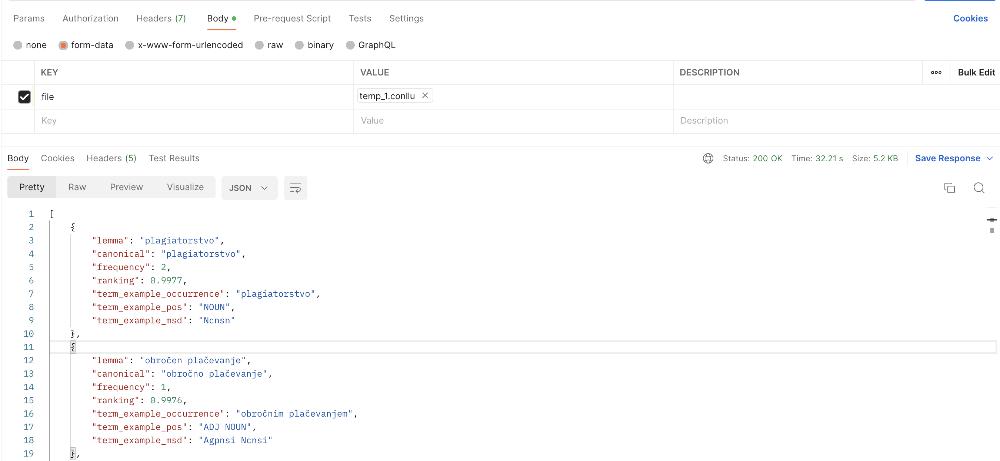

# Automatic Term Extraction API

## 1. Description
In this repo, we wrote an API to inference SloBERTa term extractor, whose model has been trained with [RSDO5 corpus](https://www.clarin.si/repository/xmlui/handle/11356/1400). Feel free to check out this [repo](https://github.com/honghanhh/ate-2022) for better understanding about the methodology.

---

## 2. Requirements

Please install all the necessary libraries noted in [requirements.txt](./requirements.txt) using this command:

```
pip install -r requirements.txt
```

## 3. Implementation

Download the model from [pytorch_model.bin](https://kt-cloud.ijs.si/index.php/s/T4qtSKxbxgqr6c5) and save it into `./model/term_extractor/`.

Run the following command on the terminal:

```python
main.py
```

A link will be show on the terminal so that you can access to the API and test requests locally.
```python
 * Serving Flask app 'main'
 * Debug mode: on
WARNING: This is a development server. Do not use it in a production deployment. Use a production WSGI server instead.
 * Running on http://127.0.0.1:5000
Press CTRL+C to quit
 * Restarting with stat
 * Debugger is active!
 * Debugger PIN: 185-520-689
```

## 4. Docker version
Run the following command:
```python
docker build -t ate .  
docker run -d -p 5000:5000 ate
```

## 5. Output format

For each term, we return one entry for each term lemma, for which we return also the canonical form, pos tag, ranking, as well as an example of a term form and its msd. A response of the service is encoded in a JSON format composed of the following attributes:

- `lemma`: a *string* presents the lemmatised form of the term (in the corpus, term forms with the same lemma are considered as the same terms).
- `canonical`: a *string* presents the canonical form generated.
- `frequency`: the *integer* representing the frequency of the lemmatised term in the corpus.
- `ranking`: a *float* presents the termhood ranking.
- `term_example_occurrence`: a *string* presents an example occurrence of the term in the corpus (a term can appear in different forms, e.g. different cases, and one example is returned). For the example term, we selected the one with the highest ranking score (see ranking attribute).
- `term_example_pos`: a *string* presents the part-of-speech (POS) of each word in the term example occurrence.
- `term_example_msd`: a *string* presents the msd of the term example occurrence.

Please check out the format example below:

```python
[
    {
        "lemma": "plagiatorstvo",
        "canonical": "plagiatorstvo",
        "frequency": 2,
        "ranking": 0.9977,
        "term_example_occurrence": "plagiatorstvo",
        "term_example_pos": "NOUN",
        "term_example_msd": "Ncnsn"
    },
    {
        "lemma": "obročen plačevanje",
        "canonical": "obročno plačevanje",
        "frequency": 1,
        "ranking": 0.9976,
        "term_example_occurrence": "obročnim plačevanjem",
        "term_example_pos": "ADJ NOUN",
        "term_example_msd": "Agpnsi Ncnsi"
    },
    {
        "lemma": "delen odpis",
        "canonical": "delni odpis",
        "frequency": 1,
        "ranking": 0.9971,
        "term_example_occurrence": "delnega odpisa",
        "term_example_pos": "ADJ NOUN",
        "term_example_msd": "Agpmsg Ncmsg"
    },
    ...
]
```

We suggest you use POSTMAN or Hoppscotch to test the API with an uploaded file as the output whose format is CONLL-like (plese check out [temp.conllu](temp.conllu)). See the demonstration as the image below.

The output format:


## 6. References

The term extraction tool is an updated version of Tran et al. (2022), using the SloBERTa model.

Hanh Thi Hong Tran, Matej Martinc, Andraz Repar, Antoine Doucet and Senja Pollak: A Transformer-based Sequence-labeling Approach to the Slovenian Cross-domain Automatic Term Extraction. Proc. of Jezikovne tehnologije in digitalna humanistika, 2022.

## 6. Contributors:
- 🐮 [TRAN Thi Hong Hanh](https://github.com/honghanhh) 🐮
- Matej Martinc
- Senja Pollak
